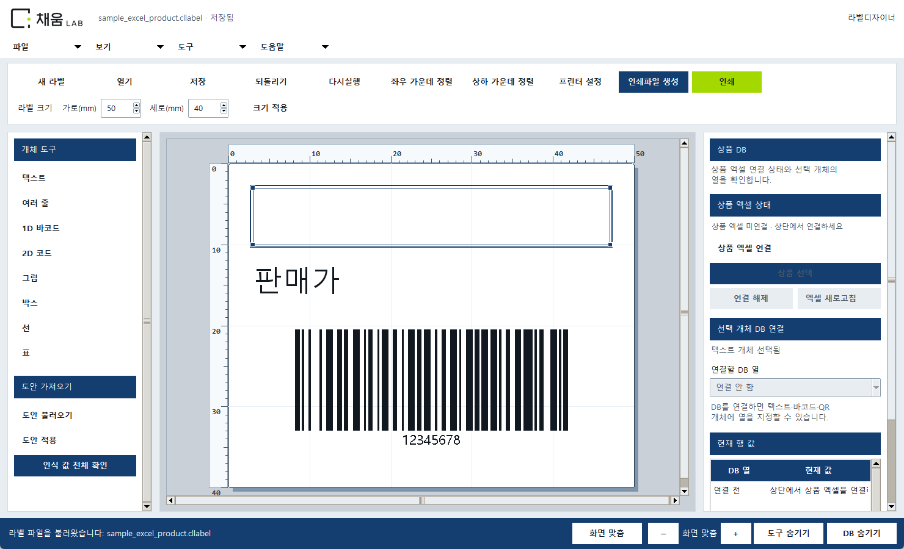
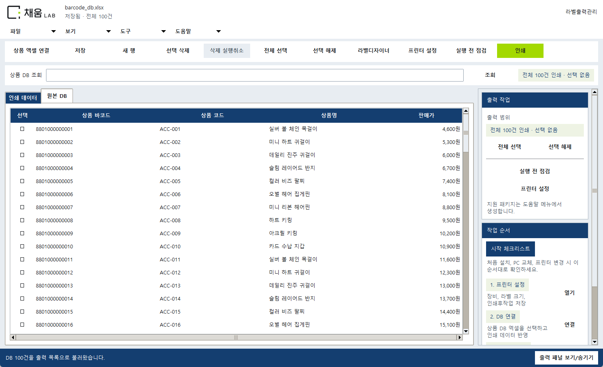
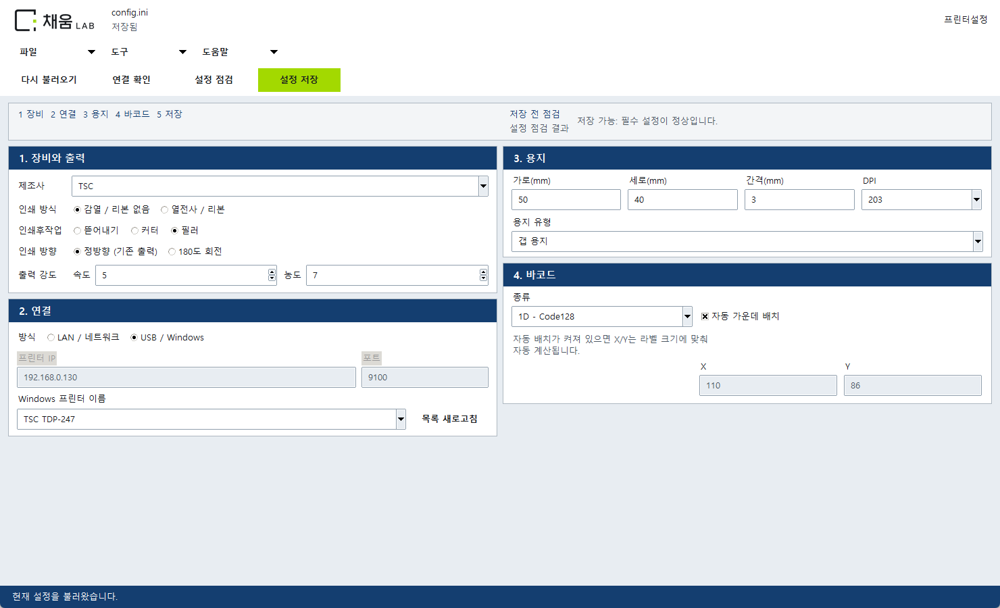

# 채움랩 전체 제품 통합 변경 완료 보고서

버전 **2026.10.06.01** · 빌드 **suite_20261006_01** · 2026-10-06 KST

## 1. 완료 결과

승인된 3번 색상안과 A안 상단·B안 좌우 카드 구성을 라벨디자이너, 라벨출력관리, 프린터설정에 적용했습니다. 실제 소스를 수정한 뒤 실행파일 6종을 clean 빌드하고 소스/고객용 실행폴더/상위 최종폴더/새 고객배포본에 같은 파일을 반영했습니다.

- 원본 채움랩 로고와 화이트·딥블루 `#143E70`·라임 `#A3D900`, 맑은 고딕 UI, 동일 메뉴·버튼·상태·대화상자·도움말.
- 디자이너 오른쪽은 DB 연결·열 매핑·값 선택 전용. 편집/이동/정밀편집 메뉴 정리.
- 상단 좌우 가운데 정렬/상하 가운데 정렬, 도안 인식 값 전체 확인.
- 출력 대상·매수 확인, 취소 시 미전송, 임시 큐 사용, 원본 DB/기본 인쇄 데이터 보존.
- 프로그램 역할별 아이콘과 도안/프로젝트 문서 아이콘. 새 `.cllabel`/`.clproject`, 기존 `.gblabel`/`.gbproject` 호환.
- 파일 연결은 사용자 기본 앱 선택을 보존하며 복원용 레지스트리 기록을 남깁니다.

## 2. 실제 변경 화면

아래는 최종 소스의 실제 실행 화면입니다. 도안과 상품은 매뉴얼용 예제입니다.

### 라벨디자이너

### 라벨출력관리

### 프린터설정

## 3. 주요 변경 파일

| 영역 | 파일 |
|---|---|
| 공통 디자인/브랜드 | `barcode_label_automation/ui_tokens.py`, `ui_style.py`, `brand_assets.py`, `scripts/create_suite_icons.py` |
| 세 프로그램 | `label_designer_app.py`, `label_manager_app.py`, `settings_app.py` |
| 파일 호환/보호 | `label_file_types.py`, `portable_project.py`, `file_association.py` |
| 배포/검증 | `release_manifest.py`, `customer_deployment.py`, `customer_preflight.py`, `scripts/build_release_exes.ps1` |
| 매뉴얼 | `scripts/build_customer_manuals.py`, `create_customer_manual.py`, `capture_customer_manual_screens.py`, `verify_customer_manuals.py`, `README.md` |

## 4. 검증 결과

| 검증 | 실제 결과 |
|---|---|
| 소스 전체 pytest | **934개 통과, 2개 권한 제한으로 미실행**. 단위/통합 930개와 새 프로세스 GUI 4개 포함. 빌드 전 원래 테스트 897개도 통과 |
| 문서/설정 후속 검증 | **50개 통과** |
| 실제 Tk 화면 | 세 프로그램 × 1366×768/1920×1080 × 100/125/150%: **18가지 통과**. 작업 버튼·문구 범위 확인 |
| 프로그램 빌드 | **EXE 6종 clean 빌드 통과**, Python 3.14 / PyInstaller 6.21.0 |
| 빌드된 프로그램 검증 | **46가지 통과**. 네 위치의 실제 EXE 실행/GUI 생성/dry-run/신구 도안·프로젝트·프로젝트 직접 인쇄 차단 |
| 고객 환경점검 | 실행폴더와 새 고객배포본 각각 **정상 36개, 오류 0개** |
| 출력 명령 | BIXOLON cp949/SLCS, TSC TSPL/한글 bitmap, Zebra UTF-8/ZPL dry-run 검증. SEWOO 미승인 모델 차단 확인 |
| 파일 동기화 | EXE 6종과 고정 배포 파일 **56개** SHA-256 일치. manifest 필수/금지 파일 검증 |
| 데이터 보호 | 기존 설정·DB·인쇄 데이터·기본 도안·원본 로고·출력 글꼴 **24개 해시 불변**, 기본 도안 `elements: []` |
| 파일 연결 | 실제 빌드 EXE로 등록, 도안/프로젝트 아이콘과 열기 명령 확인, UserChoice 보존·복원 기록 생성 |
| Python/PowerShell | Python 컴파일 및 PowerShell 파서 검사 통과 |
| formatter/lint/typecheck | 저장소에 실행 명령/설정이 없어 별도 실행하지 않음 |

화면 배율은 Tk 글꼴 배율과 작업 영역을 바꾼 실행 검증입니다. 다른 고객 PC의 Windows 전역 배율까지 검증한 결과는 아닙니다. Windows Tcl의 반복 초기화 오류를 피하도록 GUI 시나리오는 각 새 Python 프로세스에서 실행했습니다. 심볼릭 링크 관련 2개 검증은 Windows 권한이 없어 미실행이며 Developer Mode 또는 CI에서 확인해야 합니다. 테스트 중 Pillow의 향후 API 변경 경고 22건이 있었으며 실패는 없습니다.

## 5. 고객 매뉴얼과 파일 정리

- 디자이너 PDF 10쪽, 출력관리 PDF 7쪽, 프린터설정 PDF 7쪽: 총 **24쪽** 전부 렌더링·육안 확인.
- 한눈에 요약 PDF 4쪽도 최신 메뉴·전체 대상 정책·파일 형식으로 갱신하고 렌더링·시각 확인했습니다.
- 통합 Word: Microsoft Word 12.0에서 실제 **16쪽** 렌더링·육안 확인. 표 행의 페이지 분할 수정.
- 각 프로그램 도움말에서 해당 `docs/고객용_매뉴얼/채움랩_...pdf`를 엽니다.
- 새 DOCX 이름: `채움랩_라벨출력패키지_고객용_매뉴얼.docx`. 텍스트 안내 3종도 실제 메뉴와 맞췄습니다.
- 이전/중복 매뉴얼 **18개**는 해시 검증 후 `outputs/suite-release-20261006/previous-manuals`에 보관했습니다. 이전 날짜 고객배포본은 유지했습니다.
- 새 고객배포본에서 로그/백업/임시 파일, 불필요한 OCR 학습 도구를 제외했습니다. OCR은 EXE 밖의 공용 런타임 구조를 유지합니다.

## 6. 배포와 복구

최신 고객배포 폴더: `고객배포/채움랩_라벨출력_고객용_20261006_01`. 폴더 전체를 복사하고 `처음실행_점검.cmd`로 설치 점검한 뒤 `시작하기.cmd`로 실행합니다.

| 실행파일 | 크기 | SHA-256 앞 16자리 |
|---|---:|---|
| 고객환경점검.exe | 19.36 MiB | `763f9991aa7c5f0e` |
| 라벨디자이너.exe | 23.08 MiB | `e9fda972f9b8a2f0` |
| 라벨작업실행기.exe | 19.33 MiB | `def7534325dd35ae` |
| 라벨출력관리.exe | 20.75 MiB | `24dd3897e56ab42b` |
| 라벨출력엔진.exe | 17.53 MiB | `cefe9e4b817da9e9` |
| 프린터설정.exe | 20.17 MiB | `e7cdb4ec58f6bd87` |

전체 해시는 배포본 `release_manifest.json`에 있습니다. 디자이너는 23.08 MiB이며 이전 22.64 MiB보다 약 0.43 MiB 늘었습니다. 이번 추가 UI/아이콘을 포함한 수치이며 OCR 중복 내장은 하지 않았습니다.

문제가 생기면 고객 데이터를 백업한 뒤 이전 `20261001_01` 배포본으로 돌아갈 수 있습니다. 새 파일 형식은 새 버전에서 기존 `.gblabel`로 다른 이름으로 저장하고, 필요한 원본 엑셀/이미지도 보관합니다. 파일 연결 변경은 기록된 rollback JSON으로 복원합니다.

GitHub `main`에 이번 소스·아이콘·매뉴얼·실행파일 반영을 확인했습니다. 검증된 제품 커밋: `93a9d403b009`. 기존 원격 안내 갱신 기능을 통합한 게시용 로컬 체크아웃에서 934개 통과, 링크 권한 제한 2개 미실행 결과를 확인했습니다. GitHub Actions 실행 결과를 뜻하지 않습니다. 기존 고객 DB/프린터 설정을 새로 게시하지 않습니다. 원격 반영 결과는 로컬 `outputs/suite-release-20261006/github-update-result.json`에 기록합니다.

GitHub 업로드는 성공했지만 공용 OCR DLL 96.77 MiB에 대용량 파일 경고가 있었습니다. 전체 고객 폴더는 약 296 MiB이며 폴더 전체를 전달해야 합니다.

## 7. 실제 장비 확인과 남은 제한

1. 실제 고객 프린터의 모델·USB/LAN·라벨 규격·DPI를 설정합니다.
2. 수량 1로 배출·방향·크기·농도·커터/필러 동작을 확인합니다.
3. 실제 1D/2D 스캐너로 선행 0과 한글/상품 값을 원본과 비교합니다.
4. 고객 PC에서 파일 더블클릭과 탐색기 아이콘 표시, PDF 도움말 열기를 확인합니다.

자동 검증 중 실제 프린터 전송은 하지 않았습니다. SEWOO는 승인 모델이 없어 현재 출력이 차단됩니다. 모델별 지원/인쇄후작업은 장비 확인이 필요합니다. `.btw`와 타사 전용 파일을 직접 변환하지 않으며 원본 프로그램에서 실제 이미지로 내보낸 뒤 도안/DB 필드를 다시 연결합니다. 확장자를 PNG로 바꾸는 것은 이미지 변환이 아닙니다. 프로젝트에는 엑셀 원본이나 글꼴 파일이 들어가지 않고, 글꼴 목록과 도안 이미지만 포함됩니다.
